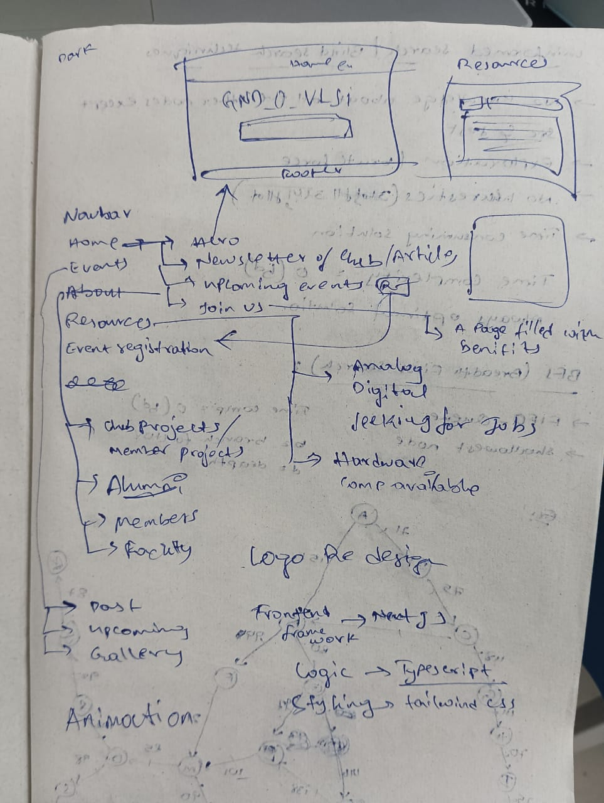
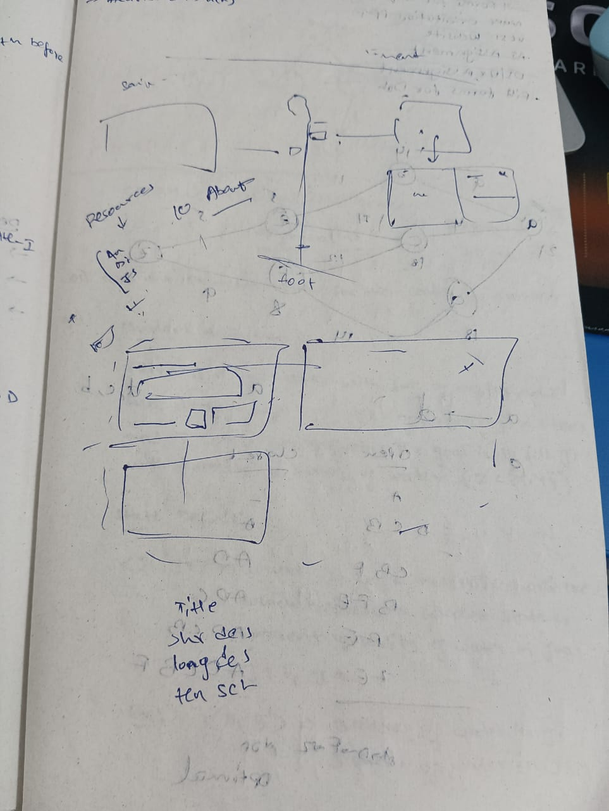

# GND_0 VLSI Club IIIT Dharwad Website

Welcome to the official website of the GND_0 VLSI IIIT Dharwad Club! This project is designed to showcase the club's activities, members, alumni, faculty, events, resources, and hardware availability, bridging academia and industry in semiconductor design.

## Overview

This is a Next.js application integrated with Sanity.io for content management. The website features a modern UI with dynamic content, including a timeline of past events, upcoming events, member profiles, alumni details, and resource listings. The design emphasizes interactivity and a futuristic aesthetic with custom animations and gradients.

- **Frontend**: Built with Next.js, TypeScript, and Tailwind CSS.
- **CMS**: Sanity.io for managing content such as members, alumni, events, and resources.
- **Features**: Responsive design, event timeline, resizable modals, carousel galleries, and hardware details with drawers.

## Prerequisites

- Node.js (v18 or later)
- npm or yarn
- Sanity CLI (for managing the Sanity project)

## Setup Instructions

1. **Clone the Repository**
   ```bash
   git clone https://github.com/GND-0/VLSI_WEB.git
   cd VLSI_WEB
   ```

2. **Install Dependencies**
   ```bash
   npm install
   # or pnpm
   # or
   yarn install
   ```

3. **Set Up Environment Variables**
   - Create a `.env.local` file in the root directory.
   - Add the following variables with your Sanity project details:
   ```text
   NEXT_PUBLIC_SANITY_PROJECT_ID=your-project-id
   NEXT_PUBLIC_SANITY_DATASET=your-dataset
   SANITY_TOKEN=your-sanity-token
   SANITY_WRITE_TOKEN=your-sanity-token-with-edit-access
   ```
   - Obtain these values from your Sanity dashboard after setting up a project.

4. **Set Up Sanity**
   - Install the Sanity CLI globally if not already installed:
   ```bash
   npm install -g @sanity/cli
   ```
   - Initialize or connect to your Sanity project:
   ```bash
   sanity init
   ```
   - Ensure the schema files (`schemaTypes/members.ts`, `schemaTypes/alumni.ts`, etc.) are synced with your Sanity dataset.
   - Clone the sanity repository in this organization for ease of use

5. **Run the Development Server**
   ```bash
   npm run dev
   # or pnpm run dev
   # or
   yarn dev
   ```
   Open http://localhost:3000 in your browser to see the app.

## Project Structure

```text
GND_0_VLSI_Club/
├── lib/                # Utility files (e.g., Sanity client)
│   └── sanityClient.ts
├── src/
│   ├── app/            # Next.js pages and API routes
│   │   ├── api/        # API routes
│   │   │   └── sanity/
│   │   │       └── route.ts
│   │   ├── events/     # Events page
│   │   │   └── page.tsx
│   │   ├── resources/  # Resources page
│   │   │   └── page.tsx
│   │   └── page.tsx    # Home page
│   ├── components/     # Reusable components
│   │   ├── AlumniCard.tsx
│   │   ├── FacultyCard.tsx
│   │   ├── MemberCard.tsx
│   │   ├── header.tsx
│   │   ├── footer.tsx
│   │   └── GlitchText.tsx
├── public/             # Static assets (e.g., images, fonts)
│   ├── image.png
│   └── f1.ttf
├── .env.local          # Environment variables
├── package.json        # Project dependencies and scripts
└── README.md           # This file
```

## Usage

- **Home Page**: Displays the club's welcome message with a glitch effect.
- **Events Page**: Shows a vertical timeline of past events and a grid of upcoming events with interactive modals for detailed views.
- **Resources Page**: Lists VLSI resources by category and hardware components with expandable drawers for more details.
- **About Page**: Highlights club members, alumni, and faculty.

## Contributing

1. Fork the repository.
2. Create a new branch (`git checkout -b feature-branch`).
3. Make your changes and commit them (`git commit -m "description"`).
4. Push to the branch (`git push origin feature-branch`).
5. Open a pull request.

## Website Design Screenshots

Below are screenshots showcasing the design of the website:

### Home Page

*Entire Layout of the website with dynamic features and good level of animation*

### Events Page

*The events page featuring the vertical timeline and upcoming events grid.*

## License

This project is licensed under the MIT License. See the LICENSE file for details.

## Contact

For questions or support, reach out to the GND_0 VLSI Club team via the LinkedIn profiles listed on the About page